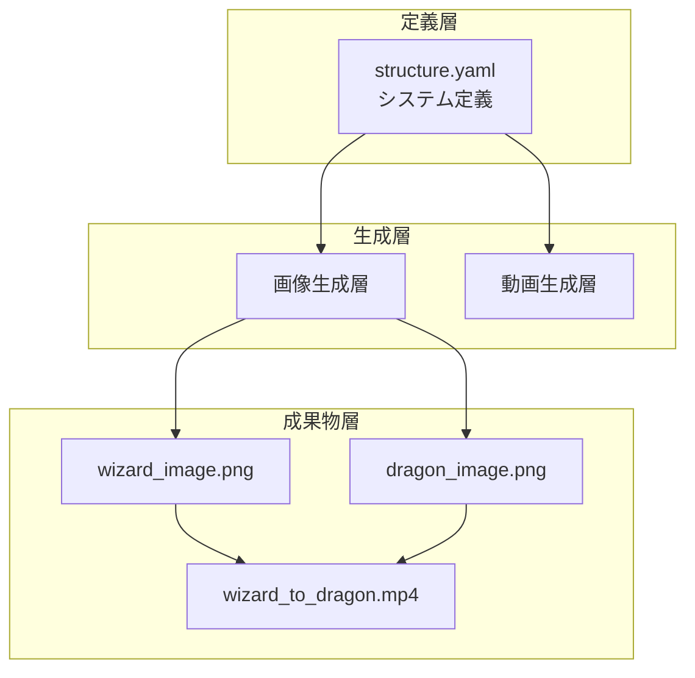

# 魔法使い変身システム アーキテクチャ解析

## 1. システムの基本構造



## 2. YAMLファイルの階層構造

### トップレベル構造
```yaml
src/
  structure.yaml      # システム全体の定義
  image-generation/   # 画像生成コンポーネント
  video-generation/   # 動画生成コンポーネント
```

### 共通要素
- `agent`: 処理を実行するAIモデル
- `dependency`: 依存関係の定義
- `dependency_wait`: 処理順序の制御
- `api`: 外部API連携の定義

## 3. システムの特徴的な性質

### 1. 階層的依存関係管理
- 上位層での設計定義
- 中間層での具体的な実装指示
- 下位層での処理実行と成果物生成

### 2. エージェントの最適化
```yaml
画像生成: t2i-luma-photon
  - 特徴: ファンタジー要素と光効果の表現に特化
  
動画生成: i2v-kling-v1.6-pro
  - 特徴: 画像間の自然な遷移生成に特化

設計層: claude-3-5-sonnet
  - 特徴: 構造化とプロンプト設計に特化
```

### 3. 品質管理システム
1. **画像生成での品質制御**
   - 詳細な特徴指定
   - 環境設定の統一
   - 構図の一貫性

2. **動画生成での品質制御**
   - 変身シーケンスの詳細定義
   - 特殊効果の指定
   - カメラワークの制御

## 4. システムの特筆すべき設計思想

### 1. モジュール性
- 各コンポーネントが独立して機能
- 明確な依存関係の定義
- 柔軟な拡張性

### 2. 品質の一貫性
- 環境設定の統一
- 画風の一貫性
- 変換効果の連続性

### 3. 処理の最適化
- タスクに特化したエージェントの選定
- 依存関係に基づく効率的な処理
- パラメータによる細かな制御

## 5. 予測されるシステムフロー

1. **初期化フェーズ**
   - structure.yamlによるシステム設定の読み込み
   - 必要なエージェントの初期化

2. **画像生成フェーズ**
   - 魔法使いとドラゴンの画像を並列生成
   - 品質チェックと環境の一貫性確認

3. **動画生成フェーズ**
   - 2つの画像間の遷移動画生成
   - 特殊効果とカメラワークの適用

4. **品質検証フェーズ**
   - 生成物の品質確認
   - パラメータの微調整（必要な場合）

このシステムは、複雑なクリエイティブタスクを構造化された方法で実行する、洗練されたアーキテクチャを持っています。