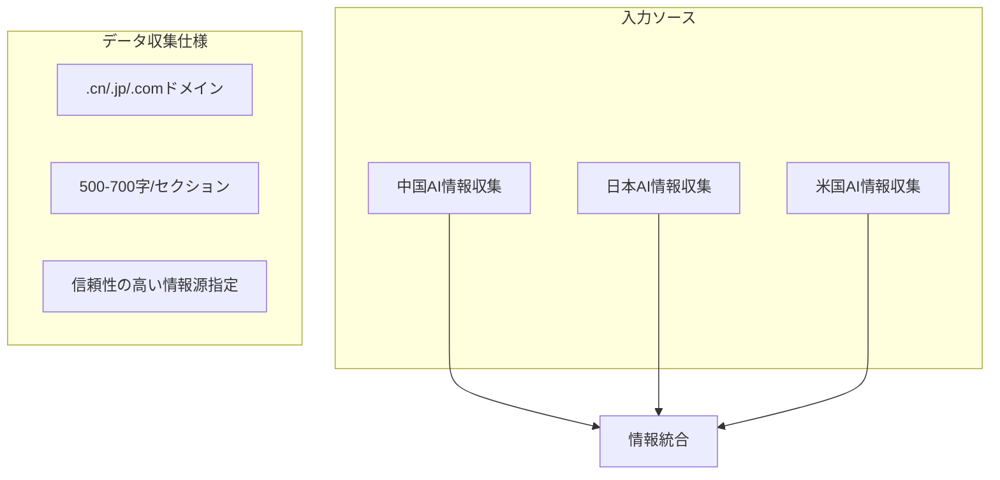
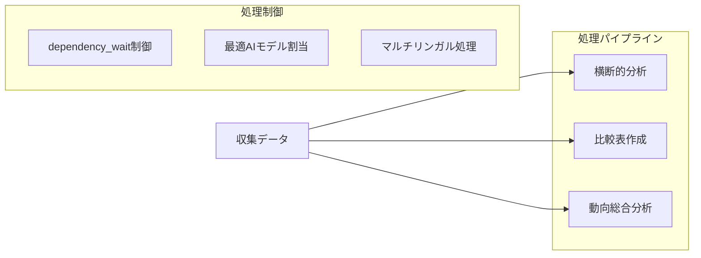
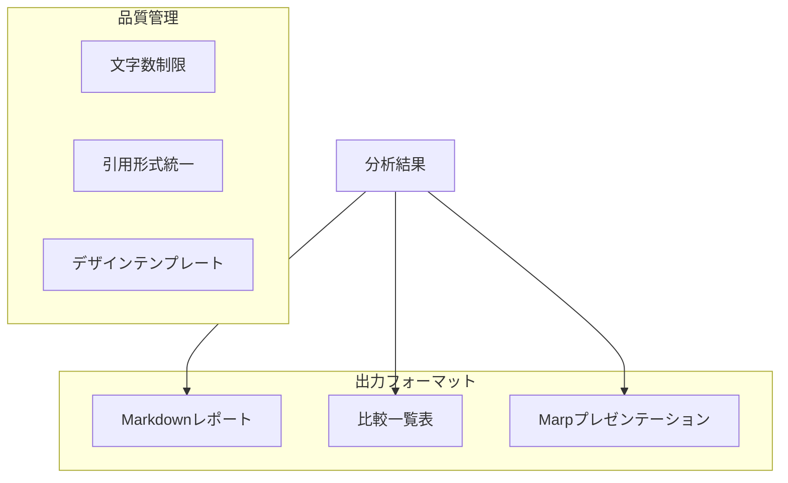
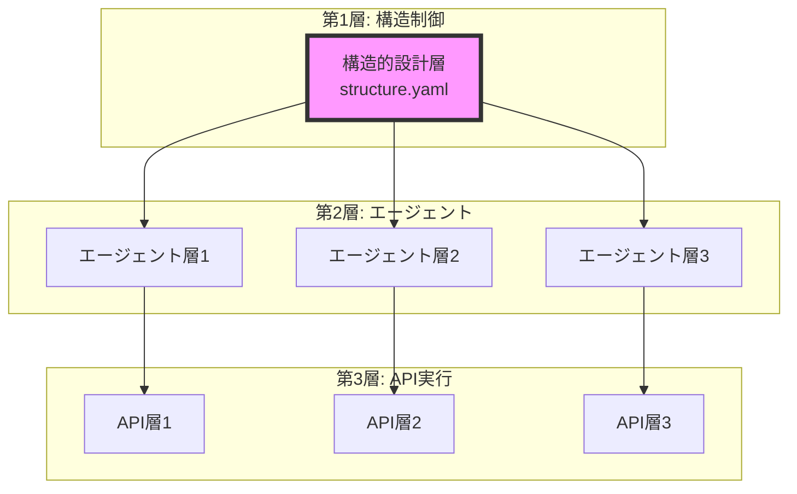

# 生成AI情報収集システムフロー

## 1. Input Layer (データ収集層)

## 2. Process Layer (処理層)

## 3. Output Layer (出力層)

## 4. System Design (システム設計)

## システムの特徴

1. **データの一貫性**
   - 各国の情報を同一フォーマットで収集
   - 統一された文字数制限と構造
   - 標準化された引用形式

2. **処理の効率性**
   - 依存関係による処理順序の最適化
   - タスク特性に応じたAIモデルの選定
   - 並列処理可能な構造

3. **出力の品質管理**
   - 統一されたデザインテンプレート
   - マルチフォーマット（MD/表/スライド）
   - 段階的な情報の統合と可視化

